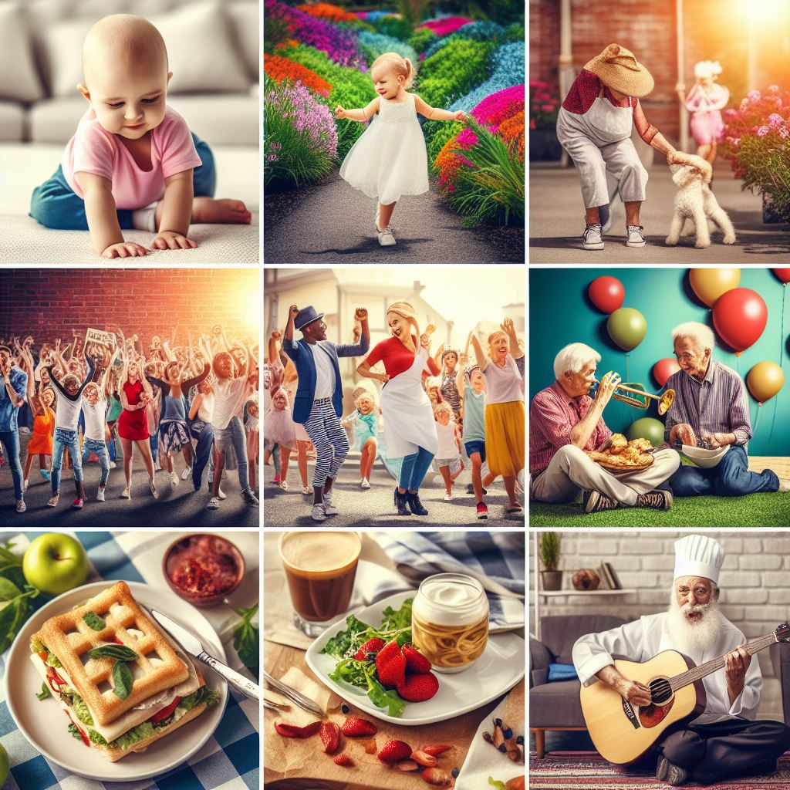

# ai900-generative-ai

Generative AI has experienced an unprecedented growth in its use. We are surely amazed by the capabilities of such a technology in terms of content generation in the form of text, images, audio and video.

More than that, these systems are becoming very similar to human beings in terms of their responses, associations, representation and knowledge about the world.

However, are they capable of understanding and representing such abstract concepts such as life, love, or even missing someone?

This repository is dedicated to address the previous question by exploring the capabilities of [Microsoft Copilot](https://copilot.microsoft.com/).

### Life

> Input: Create an image of life.

### Missing someone

> Input: Create an imagem that represents the feeling o missing someone.

### Love

> Input: Create an image that represents the feeling of love.

Of course, there is no such a thing as a correct answer to those requests. I would probably represent create different images to represent these feelings. Nonetheless, despite certain visual inconsistencies, we can't deny that the results are quite impressive and surely meaningful.
